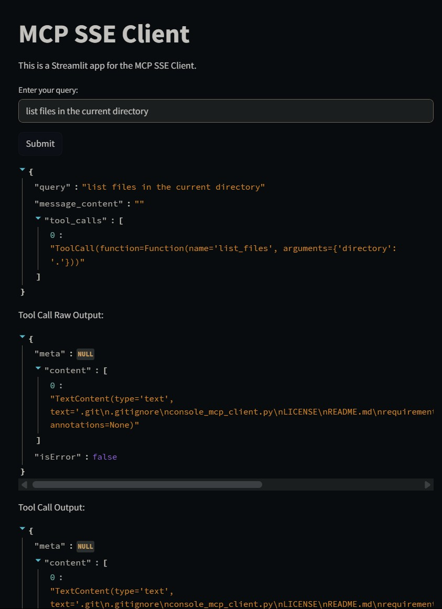
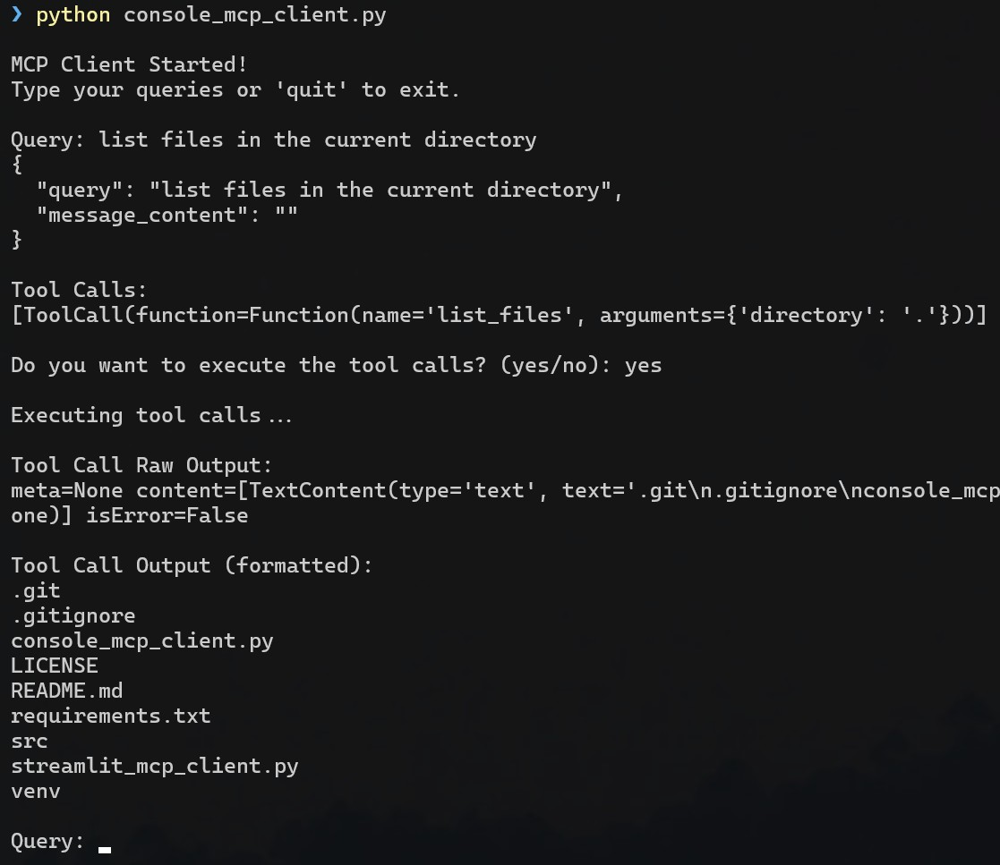

# SSE-MCP-Toolkit

All you need to build your own SSE MCP Clients and Servers to equip any LLM agent with all kinds of tools.

# Features

- [**McpSseClient**](./src/mcp_sse_client/client.py): A client that connects to an SSE MCP server and provides a simple interface to interact with the server. Its abilities include:

  - Opening and closing connections to the server
  - Registering available MCP server tools
  - Processing prompts
  - Executing returned tool calls

- [**McpSseServer**](./src/mcp_sse_server/server.py): An SSE MCP server template that provides tools to the implemented LLM agents. Its abilities include:

  - Make your own tools/functions and expose them using the mcp tool decorator
  - List available tools to the MCP client
  - Run an MCP SSE Server using [Starlette]() and [uvicorn]() on the specified port
  - Can be started using `python ./mcp_sse_server/server.py`

- [**OllamaAgent**](./src/ollama_agent/agent.py): An agent that uses Ollama's LLMs to process prompts and return tool calls. It provides:
  - A simple interface to send prompts to a locally ran Ollama LLM
  - Support for tools integration: you can provide the tools to the LLM either directly or from the MCP server
  - Returns the tool calls to the MCP client for execution
  - Support for chat history to provide context for the LLM
  - [**OllamaToolsRegistry**](./src/ollama_agent/tools_registry.py): A registry to manage tools for the Ollama agent. It currently allows you to parse MCP Tools, which are mainly tailored to Claude, to a format that Ollama can understand.

# Implementation Examples

- [**Console MCP Client**](./console_mcp_client.py): A simple console client that connects to an MCP server and allows you to interact with it using the command line. It provides a basic interface to send prompts and receive tool calls.

Run it using `python console_mcp_client.py` after starting the MCP server.

- [**Streamlit MCP Client**](./streamlit_mcp_client.py): A Streamlit application that connects to an MCP server and provides a web interface to interact with it. It allows you to send prompts and receive tool calls in a user-friendly way.

Run it using `streamlit run streamlit_mcp_client.py` after starting the MCP server.

# Installation

First start a virtual environment and install the required packages:

```bash
python -m venv venv
source venv/bin/activate  # On Windows use `. ./venv/Scripts/activate`
pip install -r requirements.txt
```

# Usage

_Note: Make sure you have a running LLM model, i.e. Ollama llama3.2 that is the default in this repo, and a running MCP server before starting the clients._

To run the MCP server, use the following command:

```bash
python .\src\mcp_sse_servers\sse-server.py
```

To run the console MCP client, use the following command:

```bash
python console_mcp_client.py
```

To run the Streamlit MCP client, use the following command:

```bash
streamlit run streamlit_mcp_client.py
```

# Screenshots

## **Streamlit MCP Client**



## **Console MCP Client**



# License

This project is licensed under the MIT License - see the [LICENSE](./LICENSE) file for details.

# Contributing

Contributions are welcome! Feel free to open issues or pull requests.
